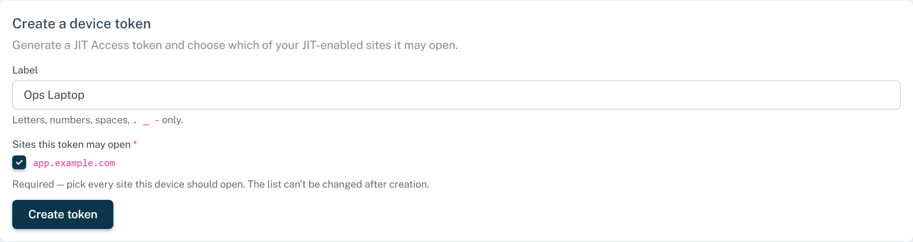
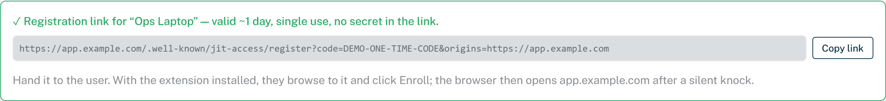
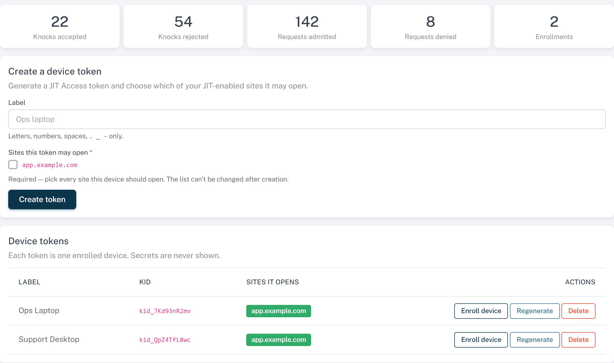

# JIT Access — BunkerWeb plugin guide

The **JIT Access** plugin keeps a service **dark** (no response at all to
unauthorized clients) until a paired browser extension answers a time‑based
challenge. A valid "knock" creates a temporary, self‑expiring allow entry for
that client's IP. Simple mode needs no Redis, database, or external service —
all state lives in nginx shared memory.

This guide covers the admin workflow: enabling the gate on a service, issuing a
device token, and handing an enrollment link to a user. For the browser side,
see the [Chrome extension guide](chrome-extension-guide.md).

> Screenshots below use `app.example.com` and placeholder token IDs in place of
> real hostnames.

---

## 1. Enable JIT on a service

On the service's configuration page (or Global Config), open the **JIT Access**
plugin section and turn on **Enable JIT Network Access** (`USE_JIT_ACCESS`). The
service goes dark on the next reload, and the **JIT Access** management page
appears in the left menu (it only shows once at least one service has the plugin
enabled).

The defaults are correct for most deployments — `interstitial` failure mode
(shows a short "device authorization" page with a detection marker), `ip`
binding, and a 1‑hour grant TTL. See the [settings reference](#settings-reference)
for the rest.

> **Whitelist interaction:** BunkerWeb's whitelist runs *before* JIT Access and
> short‑circuits the security chain — a whitelisted client (e.g. an office IP in
> `WHITELIST_IP`) reaches the service **without** knocking. To actually gate a
> network, that network must not be whitelisted on the service.

---

## 2. Create a device token

Go to **Plugins → JIT Access**. Under **Create a device token**, give the device
a label, tick **every** site the device should be able to open, and click
**Create token**.

- **Selecting at least one site is required.** A token can't be edited after
  creation, so one with no sites would open nothing, permanently.
- Each token represents one device. The secret is generated server‑side and is
  **never shown** — the device receives it during enrollment, not here.
- The token activates on the next config reload (usually under a minute).

---

## 3. Hand the user an enrollment link

In the **Device tokens** table, click **Enroll device** on the token's row. A
registration link is generated inline:

Click **Copy link** and send it to the user (email, chat, ticket). The link is:

- **Single‑use** and valid for ~24 hours by default (configurable via
  `JIT_ACCESS_ENROLL_TTL`, 5 min – 7 days) so a user can still enroll the next
  day.
- **Secret‑free** — the one‑time code in the link is exchanged for the device
  secret over TLS at enrollment time; the secret never travels in the URL.

The user opens the link in a browser that has the [extension](chrome-extension-guide.md)
installed and clicks **Enroll**. From then on that browser opens the site
transparently after a silent knock.

---

## 4. Manage tokens and watch activity

The management page is the whole lifecycle in one place:

**Metric cards** (top) show, since the last worker start: knocks accepted /
rejected, requests admitted / denied, and enrollments.

**Per‑token actions:**

| Action | Effect |
| --- | --- |
| **Enroll device** | Generate a fresh registration link for that token. |
| **Regenerate** | Issue a new secret for the same token. The old device stops working immediately and must re‑enroll. Use when a device is replaced. |
| **Delete** | Remove the token, strip its `kid` from every service's allow‑list, and revoke any active grant right away. |

Regenerate and Delete take effect on live sessions immediately (active grants are
evicted through the instance API), not just at TTL expiry.

---

## Settings reference

Configured on the service's **JIT Access** settings section. `multisite`
settings can differ per service; `global` settings apply instance‑wide.

| Setting | Default | Scope | Meaning |
| --- | --- | --- | --- |
| `USE_JIT_ACCESS` | `no` | multisite | Gate this service (dark until a valid knock). |
| `JIT_ACCESS_TOKENS` | — | multisite | Space‑separated token `kid`s allowed to open this service, or `*` for any. **Managed automatically** when you create tokens on the plugin page. |
| `JIT_ACCESS_GRANT_TIME` | `3600` | multisite | Grant lifetime in seconds. The allow entry expires automatically. |
| `JIT_ACCESS_FAILURE_MODE` | `interstitial` | multisite | `interstitial` = short authorization page + detection marker (best UX). `stealth` = generic 404 (gate invisible). |
| `JIT_ACCESS_BINDING` | `ip` | multisite | `ip` admits the client IP. `ip+cookie` also requires a device‑bound cookie (hardened). |
| `JIT_ACCESS_SKIP_CHECKS` | `no` | multisite | If `yes`, a valid grant short‑circuits the rest of the security pipeline (whitelist semantics). Pair with `ip+cookie`. |
| `JIT_ACCESS_URI_PREFIX` | `/.well-known/jit-access` | multisite | Base path for the challenge/respond/enroll endpoints. Advanced — enrolled devices knock on whatever prefix was active when they enrolled. |
| `JIT_ACCESS_ENROLL_TTL` | `86400` | global | Enrollment link/code lifetime in seconds (24 h default, clamped 300–604800). Links survive config reloads; a full nginx restart voids outstanding links. |
| `JIT_ACCESS_NONCE_TTL` | `60` | global | Seconds a challenge nonce stays valid. Dominates knock freshness. |
| `JIT_ACCESS_TRUST_REALIP` | `no` | global | Key grants on BunkerWeb's resolved real IP instead of the TCP peer. Enable **only** genuinely behind a trusted proxy with a narrowed `REAL_IP_FROM`. |
| `JIT_ACCESS_IPV6_PREFIX` | `128` | global | IPv6 grant granularity. `128` = exact address. `64` = whole /64 (pair with `ip+cookie`). |
| `JIT_ACCESS_RATELIMIT` | `10r/m` | global | Per‑IP rate limit on the knock endpoints. |

---

## Notes & caveats

- **Activation delay.** New tokens and allow‑list changes take effect on the next
  scheduler reload (usually under a minute). "Enroll device" before the token is
  loaded returns a friendly "not loaded yet, try again" message.
- **Enrollment codes are single‑use** and expire per `JIT_ACCESS_ENROLL_TTL`.
  They live in nginx shared memory and survive reloads; a full nginx restart
  clears any outstanding (un‑redeemed) codes.
- **A 403 is not a JIT denial.** JIT Access denies with the `interstitial`
  page (a 403 carrying an `X-JIT-Access` marker) or a `stealth` 404; a plain 403
  from another plugin means the request never reached JIT Access.
- **Client IP is the un‑forgeable TCP peer by default** (`$realip_remote_addr`),
  immune to `X‑Forwarded‑For` spoofing. Only set `JIT_ACCESS_TRUST_REALIP=yes`
  when genuinely behind a trusted proxy.
