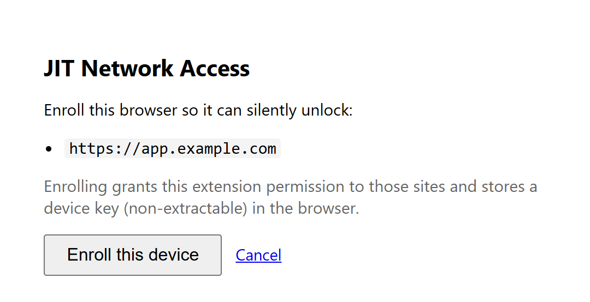
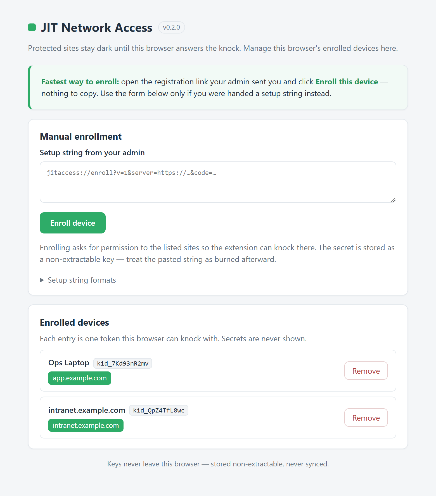
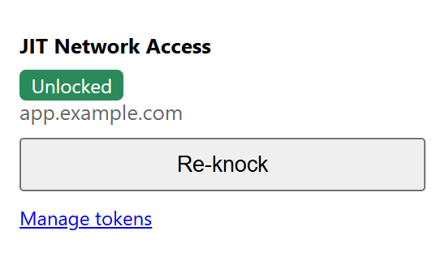
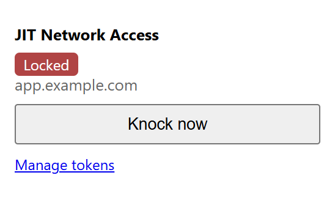

# JIT Access — Chrome extension guide

The JIT Access browser extension is the device half of the system. It stores a
per‑device key, silently answers the server's time‑based challenge (the "knock"),
and lets protected sites open transparently — the user never sees the gate once
their browser is enrolled.

This guide covers installing the extension, enrolling a device, and day‑to‑day
use. For issuing tokens and enrollment links, see the
[BunkerWeb plugin guide](bunkerweb-plugin-guide.md).

> Screenshots below use `app.example.com` and placeholder token IDs in place of
> real hostnames.

---

## Install

The extension is a Chromium MV3 extension (Chrome, Edge, Brave, …). Until it's on
a store, load it unpacked:

1. Open `chrome://extensions`.
2. Turn on **Developer mode** (top‑right).
3. Click **Load unpacked** and select the `extension/` folder.

Pin it to the toolbar so the status popup is one click away.

---

## Enroll a device (the easy way)

Ask your admin for a **registration link**. Open it in the browser you want to
enroll — the extension intercepts the link and shows this confirmation page:

Click **Enroll this device**. The browser asks permission for the listed
site(s); accept, and the extension pulls the device key over TLS and stores it.
That's it — the site now opens transparently. Nothing to copy or paste.

Behind the scenes: the one‑time code in the link is exchanged for the device
secret, which is imported as a **non‑extractable** key. The secret never appears
in the URL and can't be read back out of the browser.

---

## Enroll a device (manual setup string)

If your admin handed you a **setup string** instead of a link, open the
extension's options page (**Manage tokens** in the popup, or the **Details →
Extension options** entry in `chrome://extensions`) and use **Manual
enrollment**:

Paste the setup string and click **Enroll device**. The recommended form carries
a one‑time `code` (the secret is fetched over TLS, never in the string); a
direct‑import form with an inline secret is also accepted for testing. Expand
**Setup string formats** on the page for the exact syntax. Treat the pasted
string as burned afterward.

---

## Day to day: the toolbar popup

Click the toolbar icon on any site to see its status:

| Unlocked | Locked |
| --- | --- |
|  |  |

- **Unlocked** (green) — the browser has a live grant for this site; it's open.
  **Re‑knock** refreshes the grant early if you want.
- **Locked** (red) — the site is protected and enrolled but not currently
  granted. **Knock now** knocks immediately; normally this happens on its own
  when you visit the site.
- If the site isn't protected/enrolled, the popup just says so.

In normal use you don't touch the popup at all: visiting an enrolled site knocks
automatically and the page loads. The first hit may briefly show the server's
"device authorization" page while the extension knocks and reloads.

---

## Manage enrolled devices

The options page lists every token this browser can knock with, by label and the
site(s) it opens (see the [options screenshot](#enroll-a-device-manual-setup-string)
above). Click **Remove** on a row to delete that device key from this browser —
it loses access to those sites until re‑enrolled. Removing here only affects this
browser; it does not revoke the token server‑side (an admin does that with
**Regenerate** or **Delete** on the plugin page).

---

## Security notes

- **Keys never leave the browser.** The device secret is imported as a
  non‑extractable `CryptoKey` in IndexedDB; raw bytes are discarded after import.
  Non‑secret config (token id, origins, label) lives in `chrome.storage.local`.
  Nothing is ever written to `chrome.storage.sync`, so keys are never uploaded to
  a browser account.
- **Least privilege.** The extension requests host permission only for the
  specific origins you enroll, at the moment you enroll them — not broad web
  access.
- **No external attack surface.** The extension exposes no `externally_connectable`
  messaging and returns no proof across a message boundary; the enrollment
  confirmation page refuses to run inside a frame.
- **The server is always authoritative.** The extension keeps only a short local
  grant cache (cleared on browser exit); every real decision is made by the
  server on each request.
