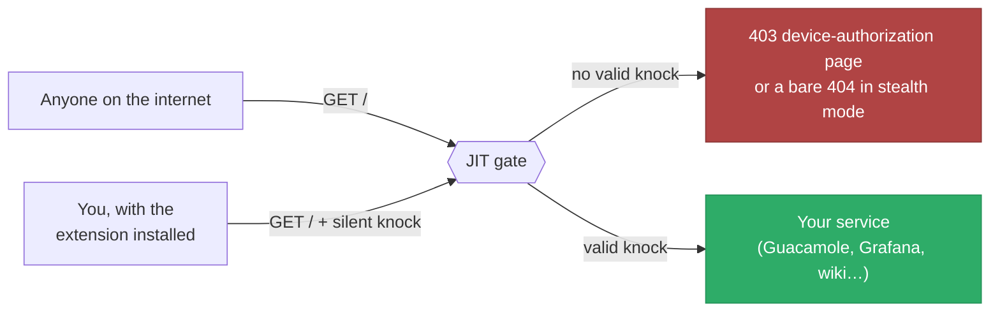
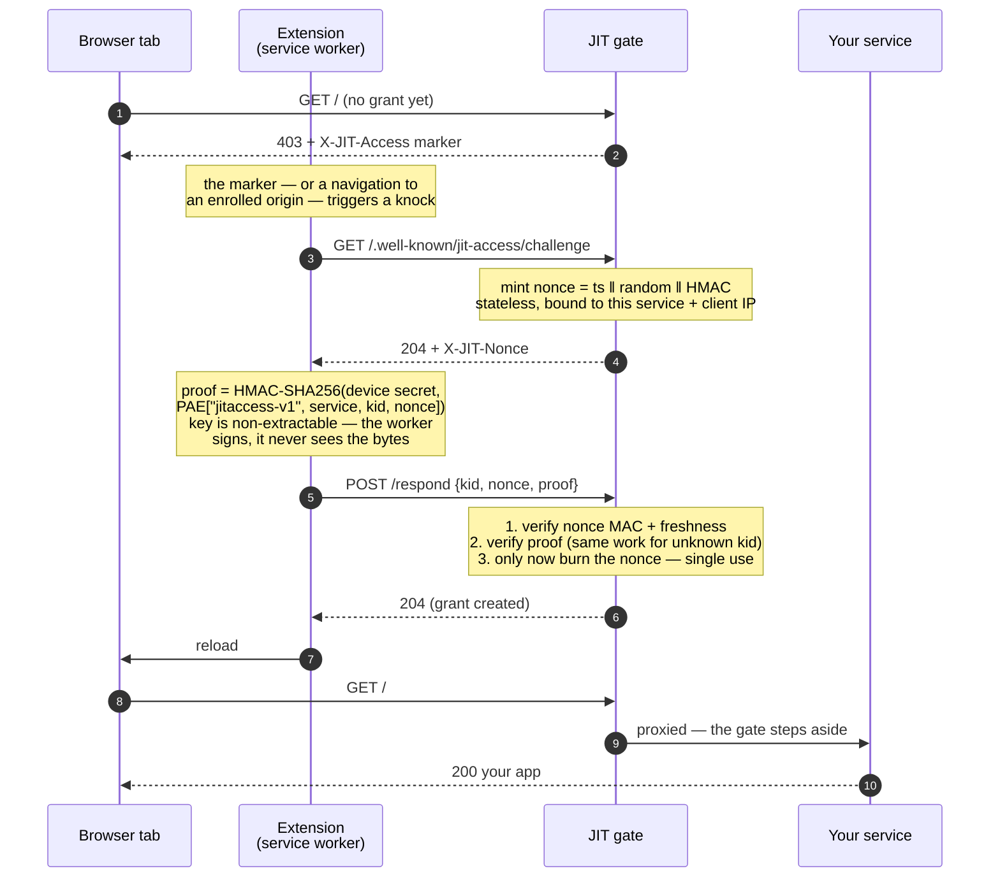
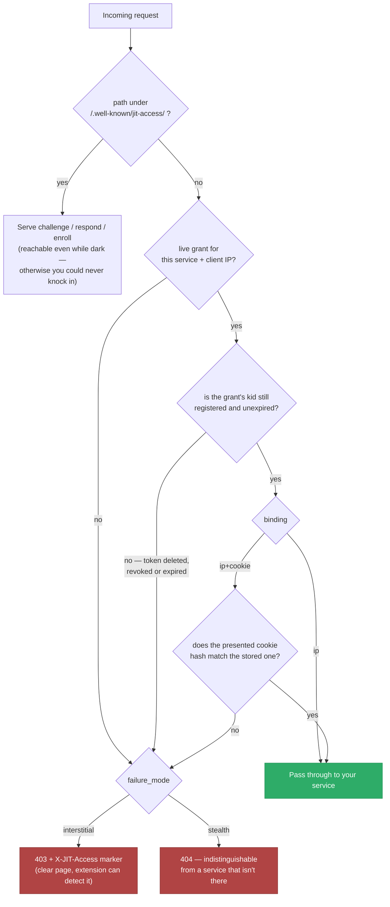
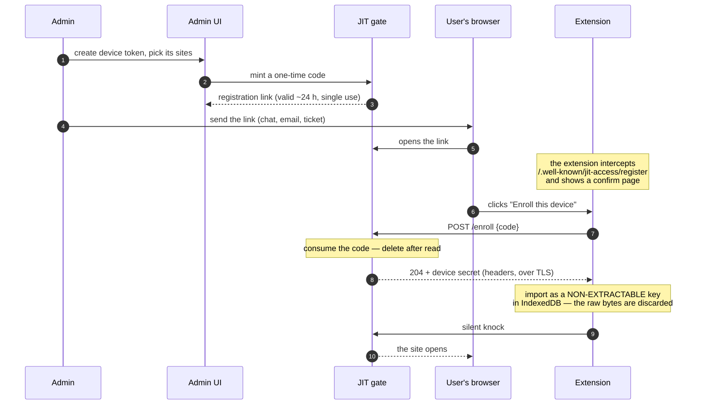
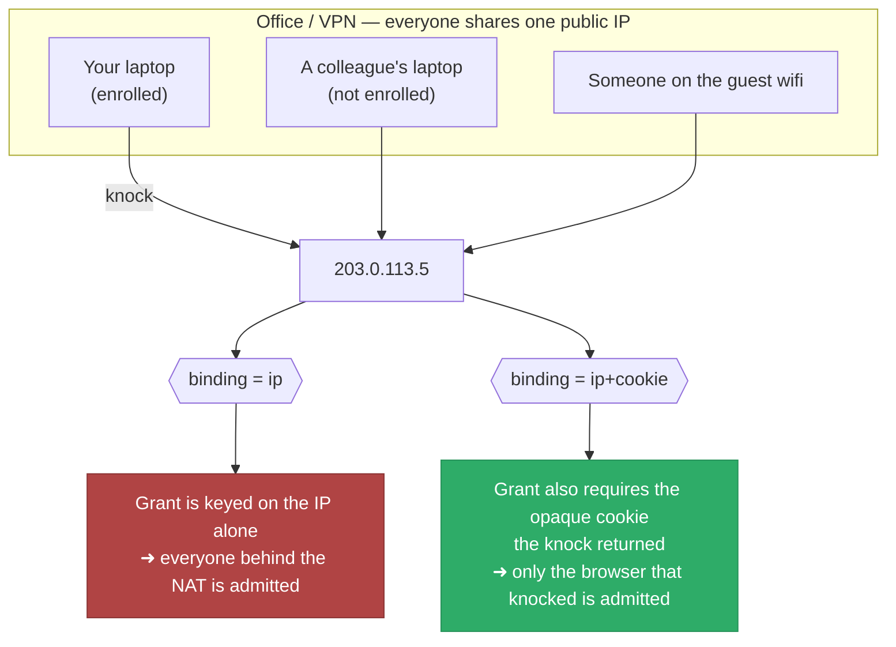
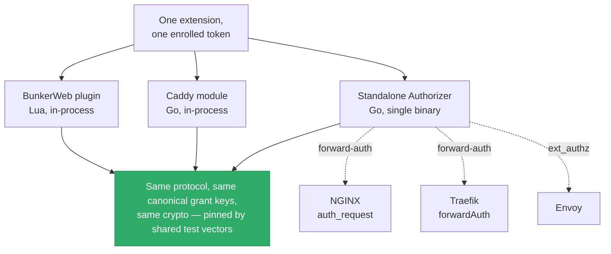
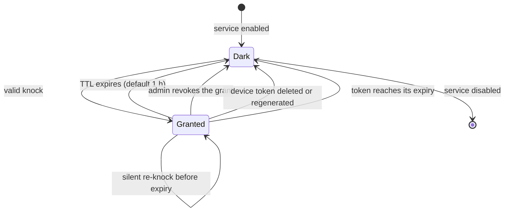

# How JIT Network Access works

A visual tour of the protocol, from "the service is invisible" to "the page just
opens." Every diagram below reflects the implementation as built — the wire
format is pinned by [`PROTOCOL.md`](PROTOCOL.md) and the shared conformance
vectors.

---

## 1. The idea in one picture

A protected service answers **nothing useful** to an unknown visitor. A browser
with an enrolled device key silently proves itself and gets a short-lived pass.
No login screen, no VPN client, no user interaction.



It is [Single Packet
Authorization](https://en.wikipedia.org/wiki/Single_Packet_Authorization)
(fwknop-style port knocking) reimagined for HTTPS and the browser: the "knock"
is an HTTP handshake instead of a crafted UDP packet, so it survives NAT, works
over 443, and needs no client software beyond a browser extension.

---

## 2. The knock handshake

This is the core protocol. It runs in about two round trips, entirely in the
background, on the protected origin's own hostname.



Three details carry most of the security weight:

**The nonce is stateless.** It carries its own HMAC and is bound to the service
and the client IP, so `/challenge` stores nothing. A flood of challenges costs
the server no memory — only *successful* knocks consume a spent-nonce slot.

**Verify, then burn.** The nonce is marked used only after the proof fully
verifies. A wrong proof therefore can't consume someone else's nonce.

**Unknown key IDs cost the same as wrong proofs.** The gate always computes
exactly one HMAC — with a dummy key when the `kid` is unknown — so response
timing never reveals which device IDs exist.

---

## 3. What the gate decides on every request

The grant isn't checked once at login; it's re-evaluated on **every** request.
That's what makes revocation instant rather than eventual.



Notice the re-check in the middle: deleting a device token evicts every grant it
issued on those clients' **next request**, not when the grant would have expired.

Everything on this chart fails closed. Any error, unparseable address, missing
config, or store failure lands on the deny path — the gate never opens a service
because something went wrong.

---

## 4. Enrolling a device

The device secret never travels in a link, a QR code, or an email. The admin
hands out a **single-use code**; the extension trades it for the secret over TLS.



What this buys: a link that leaks (forwarded email, shoulder-surfed screen) is
worth nothing after first use or after its window closes, and it never contained
the long-term secret in the first place. Once imported, the key cannot be
exported from the browser — not by the page, not by the extension, not by
another extension.

---

## 5. Grant binding: why `ip` isn't always enough

A grant admits **an address**. Behind a shared egress — an office NAT, CGNAT, a
VPN concentrator — that address isn't one person.



With `ip+cookie`, a successful knock also returns a random, opaque grant id:

```
__Host-jit-grant=<32 random bytes>; Path=/; Secure; HttpOnly; SameSite=Strict
```

Only its SHA-256 is stored, and the comparison is constant-time — a dump of the
grant store yields nothing you could replay. Every attribute is load-bearing:

| Attribute | What breaks without it |
| --- | --- |
| `__Host-` prefix | a sibling subdomain could set or overwrite the grant cookie |
| `SameSite=Strict` | a malicious page could drive a victim's browser through the gate via a cross-site link |
| `HttpOnly` | script on the origin could read the grant id |
| stored as a hash | the grant store would hold a working credential |

---

## 6. One protocol, four engines

The gate is not tied to any single web server. The extension speaks only the
wire protocol and never knows what's enforcing it.



Two implementations of the core exist — Lua and Go — and both are held to the
same byte-level conformance vectors, so a proof minted by the extension verifies
identically no matter which engine answers. That claim is tested, not asserted:
the same knock client and the same device token unlock a service behind each
engine.

**In-process vs. forward-auth** is the one architectural difference worth
knowing. The BunkerWeb and Caddy gates run inside the web server, so they read
the client's real TCP address directly. The Authorizer sits *behind* a proxy, so
its peer is the proxy — it has to trust one specific header from specific hops,
which is why its config has a `trusted_proxies` list and why it refuses requests
from anywhere else.

---

## 7. The lifetime of a grant



Grants are deliberately short-lived and self-expiring. There's no session to
clean up and no revocation list to propagate: the worst case for a stolen laptop
is that its access dies at the TTL, and the best case is that you delete the
token and it dies on the next request.

---

## Where to go next

- **[BunkerWeb plugin guide](bunkerweb-plugin-guide.md)** — enable the gate,
  issue tokens, hand out enrollment links
- **[Chrome extension guide](chrome-extension-guide.md)** — install, enroll,
  day-to-day use
- **[PROTOCOL.md](PROTOCOL.md)** — the normative wire format
- **[core/SPEC.md](../core/SPEC.md)** — the portable core contract every engine
  implements
